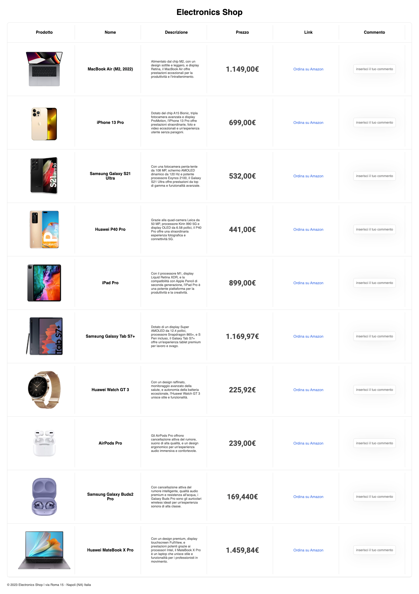

#Esercizio sulla manipolazione del DOM!

Creare un sito e-commerce. L'homepage sarà la vetrina dei prodotti disponibili, con qualche informazione per ciascun prodotto. Non sono richieste funzionalità di carrello/cassa.

# Screenshot Ecommerce

